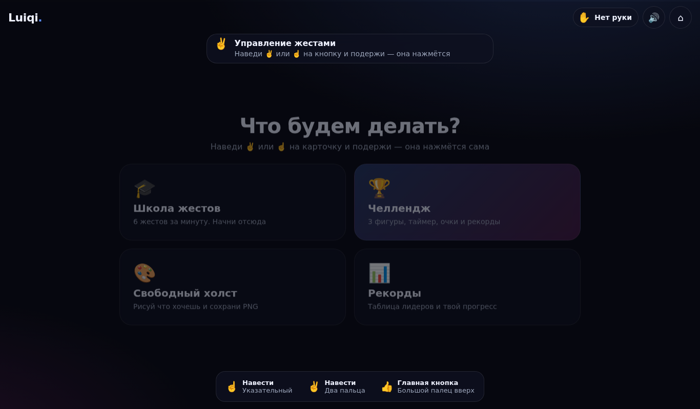
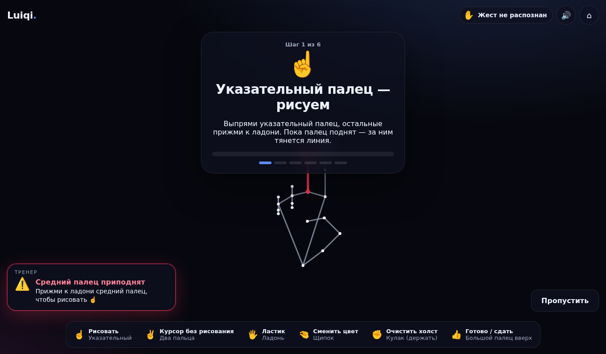
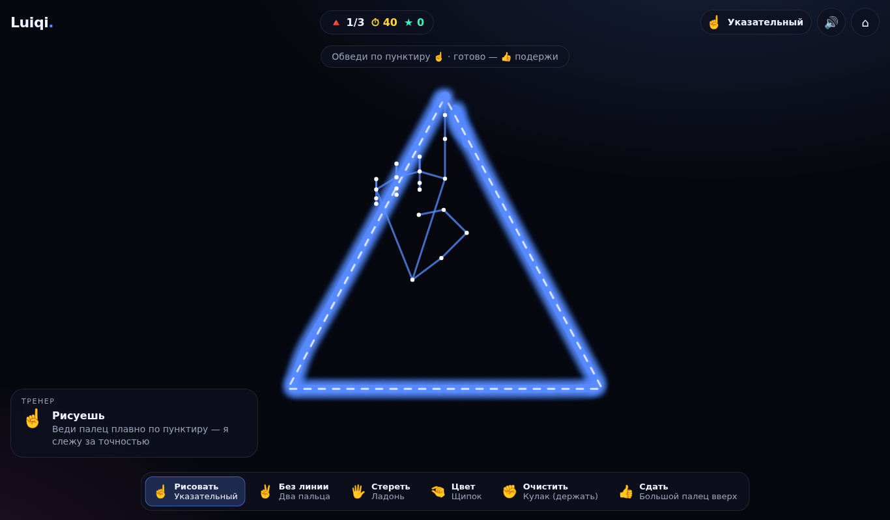
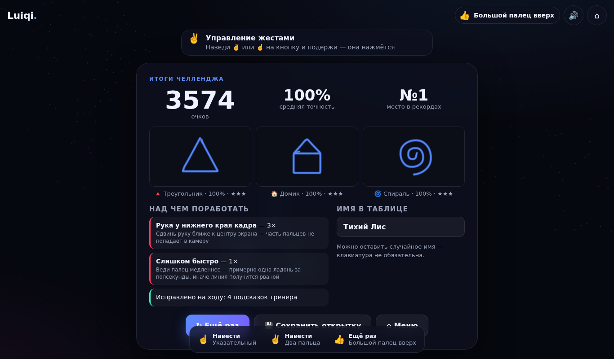

# Luiqi · Рисуй руками ✋🎨

**Admit Hackathon 2026 · кейс «Motion» · направление C (свободное): рисование руками.**

Веб-приложение, в котором веб-камера заменяет мышь. Рисуешь указательным пальцем в воздухе, стираешь ладонью, меняешь цвет щипком, сдаёшь рисунок жестом 👍. Встроенный **тренер** замечает неточные жесты и движения и говорит конкретно, что исправить: *«Средний палец приподнят — прижми его к ладони, чтобы рисовать ☝️»*.

🔗 **Рабочая версия:** https://yarmolenko08diana.github.io/admit-luiqi/ (после включения GitHub Pages, см. ниже)

| Меню | Тренер замечает ошибку | Обводка фигуры | Итоги |
|---|---|---|---|
|  |  |  |  |

> На скриншотах вместо живой руки — синтетическая поза из автотеста (видео с камеры не показано).

---

## Как запустить

Ничего устанавливать не нужно: нужен только браузер с камерой (Chrome, Edge, Safari, Firefox; компьютер или телефон).

**Вариант 1 — открыть деплой** по ссылке выше и разрешить доступ к камере.

**Вариант 2 — локально** (камера в браузере работает только на `https://` или `localhost`, поэтому файл `index.html` нужно открыть через любой локальный сервер):

```bash
git clone https://github.com/yarmolenko08diana/admit-luiqi.git
cd admit-luiqi
npx http-server . -p 8080 -c-1        # или: python3 -m http.server 8080
```

Открыть http://localhost:8080 → «Включить камеру и начать».

Библиотека MediaPipe, WASM-файлы и модель руки лежат прямо в репозитории (`vendor/`, `models/`), поэтому приложение не зависит от внешних CDN и работает даже без интернета после загрузки страницы. Видео обрабатывается только в браузере и никуда не отправляется.

### Советы для лучшего распознавания
- Сядь в 40–60 см от камеры, рука на уровне груди, ладонь к камере.
- Нужен нормальный свет — если темно, тренер сам об этом скажет.
- В кадре должна быть одна рука (тренер предупредит про вторую).

---

## Сценарий: от первого движения до результата

1. **Старт.** Одна кнопка «Включить камеру» (браузер требует разрешение). Дальше мышь не нужна: любую кнопку можно «нажать», наведя на неё палец ✌️/☝️ и подержав ~1 секунду (кнопка заполняется), а главную кнопку экрана — жестом 👍.
2. **Школа жестов** — 6 шагов. На каждом нужно показать и удержать жест; прогресс-бар заполняется, тренер поправляет.
3. **Челлендж** — 3 раунда нарастающей сложности (лёгкая фигура → средняя → сложная; случайно из 7: круг, треугольник, сердце, волна, домик, звезда, спираль). Нужно обвести пунктир за 45 секунд, начиная с зелёной точки. Раунд стартует сам, когда в кадре появляется рука (отсчёт 3-2-1).
4. **Результат раунда** — точность в %, звёзды, очки (+ бонус за скорость) и **конкретные подсказки по рисунку**: где пропущен участок контура, в какую сторону ушла линия, не замкнут ли контур.
5. **Итоги** — сумма очков, средняя точность, галерея из трёх рисунков, место в таблице рекордов, самые частые ошибки жестов с советом, как их исправить. Можно сохранить открытку PNG.
6. **Свободный холст** — рисуй что угодно палитрой из 7 цветов (включая радугу) и 3 толщин, сохраняй PNG жестом 👍.

## Жесты

| Жест | Действие | Как распознаётся (наша логика) |
|---|---|---|
| ☝️ Указательный | Рисовать | указательный прямой, средний/безымянный/мизинец согнуты |
| ✌️ Два пальца | Курсор без линии, нажатие кнопок | указательный и средний прямые, остальные согнуты |
| 🖐 Ладонь | Ластик (стирает центр ладони) | все 4 пальца прямые, большой отведён |
| 🤏 Щипок | Следующий цвет | кончики большого и указательного ближе 0.28 ладони, указательный не спрятан в кулак |
| ✊ Кулак (держать 1.2 с) | Очистить холст | все пальцы согнуты, большой прижат |
| 👍 Палец вверх (держать 0.8 с) | Сдать рисунок / сохранить / главная кнопка | 4 пальца согнуты, большой прямой, смотрит вверх и поднят над кулаком |

## Режим «ошибка» (твист) — как реализован

Тренер (`js/core/errorCoach.js`) работает на каждом кадре и проверяет четыре уровня ошибок. Каждая подсказка отвечает на два вопроса: **что не так** и **что сделать**.

**1. Форма руки — какой именно палец мешает.** Классификатор определяет состояние *каждого* пальца: прямой / **наполовину согнут** / согнут (по углам в суставах, см. ниже). Если жест не распознан, мы ищем ближайший допустимый жест (расстояние = число пальцев не в том положении, полусогнутый считается за 0.5) и строим подсказку по разнице:
- «Средний палец приподнят → Прижми к ладони средний палец, чтобы рисовать ☝️»
- «Указательный палец согнут наполовину → Выпрями указательный палец, чтобы рисовать ☝️»
- «Безымянный палец согнут → Выпрями безымянный палец, чтобы стирать 🖐»
- «Большой палец смотрит вбок → Направь его строго вверх над кулаком, чтобы сдать рисунок 👍»
- «Почти щипок → Сведи кончики пальцев вплотную (осталось ~12% ладони)»
- «Ладонь повёрнута боком → Разверни ладонь к камере»
- В школе жестов подсказка строится относительно ожидаемого жеста: «Это ✌️, а нужен ☝️: прижми к ладони средний палец».

«Неправильные» пальцы подсвечиваются **красным прямо на скелете руки** с пульсирующим кольцом на кончике.

**2. Положение в кадре:** нет руки, две руки, рука слишком близко/далеко (по размеру ладони), рука у края кадра (с указанием края с учётом зеркала), слишком темно (средняя яркость кадра).

**3. Движение:** слишком быстрое рисование (скорость кончика пальца в «ладонях в секунду», чтобы не зависеть от расстояния до камеры) — «линия получится рваной»; рука пропала посреди линии — «держи кисть в кадре, иначе линия обрывается».

**4. Точность рисунка:** во время раунда — «Линия ушла наружу от контура справа — верни палец к пунктиру»; после раунда — анализ по 9 зонам фигуры: «Пропущен участок контура снизу слева», «Сверху линия уходит наружу, за контур (до 12% размера)», «Контур не замкнут», «Слишком много лишних линий», «Линия прервалась 7 раз — держи палец выпрямленным».

Чтобы подсказки не мигали, `Coach` показывает ошибку, только если она держится 250–1500 мс (зависит от типа), удерживает её на экране минимум 1.5 с, выбирает самую важную по приоритету, а когда пользователь исправился — коротко показывает «✅ Исправлено!» со звуком. Статистика ошибок попадает в итоги: «Над чем поработать: Средний палец приподнят — 4×».

## Собственная логика распознавания

MediaPipe HandLandmarker даёт только 21 точку руки. **Всё остальное написано нами** (готовый `GestureRecognizer` не используется):

- `js/core/gestures.js` — состояние пальцев по 3D-углам в суставах PIP/DIP (изотропные координаты, чтобы углы не искажались пропорциями кадра) + отношение расстояний «кончик—запястье / сустав—запястье»; для большого пальца — отведение относительно основания мизинца. Все метрики нормированы на размер ладони, поэтому работают на любом расстоянии, при наклоне и повороте руки.
- `js/core/filters.js` — One Euro Filter для кончика пальца (плавная линия без запаздывания), гистерезис жестов (жест меняется, только если держится 3 кадра), таймеры удержания.
- `js/core/shapeScore.js` — оценка рисунка: равномерная передискретизация, покрытие контура + точность линии, штраф за каракули, анализ ошибок по зонам.
- Защита от «хвостов»: пока жест переходный (сырой кадр уже не ☝️), точки не добавляются в линию.

## Бонусы

- ✅ **Собственная логика распознавания** — см. выше.
- ✅ **Таблица рекордов и прогресс** — топ-10 на устройстве, личный рекорд по каждой фигуре («Новый личный рекорд!»), имя игрока.
- ✅ **Адаптация под телефон** — фронтальная камера, адаптивная вёрстка (компактная легенда, панель тренера снизу), учёт safe-area, пересчёт при повороте экрана, сниженное разрешение камеры для скорости; GPU с откатом на CPU.
- ✅ **Звук и визуальные эффекты** — «поющая кисть» (высота тона зависит от высоты пальца, квантуется в пентатонику), звуки жестов, отсчёта, успеха и ошибки (Web Audio, без файлов); неоновая кисть со свечением, искры за пальцем, конфетти, радужный цвет.

## Архитектура

```
index.html, css/style.css       интерфейс (все экраны — в одном документе)
js/main.js                      главный цикл: камера → точки → жест → тренер → режим → отрисовка
js/core/                        логика без DOM (покрыта юнит-тестами)
  gestures.js                   классификатор жестов по углам суставов
  errorCoach.js                 режим «ошибка»: поиск ошибок и выбор подсказки
  shapeScore.js, shapes.js      фигуры и оценка рисунка
  filters.js, geometry.js       сглаживание, гистерезис, геометрия
  handTracker.js                камера и MediaPipe HandLandmarker
  storage.js                    рекорды в localStorage (безопасно при запрете хранилища)
js/modes/                       tutorial.js, challenge.js, freeDraw.js, brush.js (жест → действие)
js/ui/                          painter.js (векторные штрихи), overlay.js (скелет, курсор, частицы),
                                hud.js, airPointer.js (нажатие кнопок жестом), audio.js
vendor/mediapipe, models/       локальная копия @mediapipe/tasks-vision 1.0.1 и hand_landmarker.task
tests/                          юнит-тесты + сквозной браузерный тест
```

Технологии: чистый JavaScript (ES-модули), Canvas 2D, Web Audio, MediaPipe Tasks Vision. Без сборки и фреймворков — чтобы жюри могло запустить проект одной командой.

## Тесты

```bash
npm test            # 32 юнит-теста: жесты, подсказки тренера, оценка рисунков, фильтры, рекорды
npm install && npm run test:e2e   # сквозной тест в Chromium (Playwright)
```

Сквозной тест открывает приложение с параметром `?test`, подаёт вместо камеры синтетические позы руки (`tests/helpers/poses.mjs`) и проходит весь сценарий на десктопе и телефоне: нажимает кнопку жестом, проверяет подсказку тренера, проходит школу жестов, обводит три фигуры, получает итоги.

Параметр `?debug` показывает на экране FPS, состояние каждого пальца, углы и метрики — удобно для отладки на реальной камере.

## Деплой

Workflow `.github/workflows/pages.yml` публикует сайт на GitHub Pages при каждом пуше в `main`. Один раз нужно включить: **Settings → Pages → Source: GitHub Actions**.

## Сторонний код и честность

- Вся логика приложения написана во время хакатона (после 28.09.2026, 07:00) — см. историю коммитов. Заготовок, сделанных заранее, нет.
- `vendor/mediapipe/` — неизменённая копия пакета [`@mediapipe/tasks-vision`](https://www.npmjs.com/package/@mediapipe/tasks-vision) 1.0.1 (Apache-2.0), `models/hand_landmarker.task` — официальная модель Google MediaPipe. Разрешено правилами кейса.
- Шрифты Manrope и Unbounded подключаются с Google Fonts (без них используется системный шрифт).
